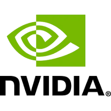
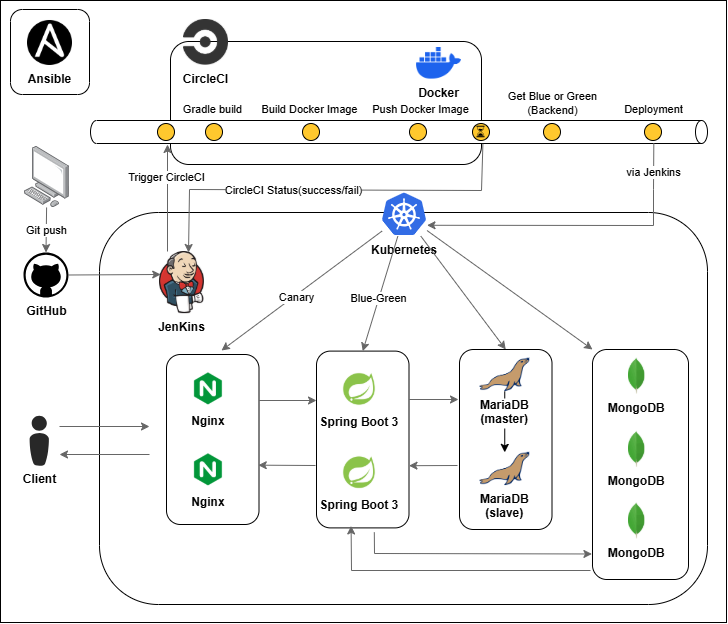


# 📈Across The Pacific (미국 주식 포트폴리오 공유 앱)

## 🗂️ 목차
1. [💻 기술 스택](#-기술-스택)  
   1.1. [📌 CI](#-📌-ci)    
   1.2. [📌 CD](#-📌-cd)  
2. [👩‍💻 팀원 소개](#-팀원-소개)
3. [📝 CI/CD 설계 및 선택 배경](#-cicd-설계-및-선택-배경)      
   3.1. [CI: CircleCI를 통한 빌드 및 Docker 이미지 푸시 전담](#ci-circleci를-통한-빌드-및-docker-이미지-푸시-전담)      
   3.2. [CD: Jenkins를 통한 Kubernetes 직접 배포](#cd-jenkins를-통한-kubernetes-직접-배포)         
   3.3. [MongoDB의 StatefulSet 기반 클러스터 구성](#-mongodb의-statefulset-기반-클러스터-구성)
5. [🎞️ 프론트엔드 CI/CD 시나리오](#-프론트엔드-cicd-시나리오)
6. [🎞️ 백엔드 CI/CD 시나리오](#-백엔드-cicd-시나리오)
7. [▶️ 배포 영상](#-배포-영상)  
   6.1. [전체 시스템 구성](#-전체-시스템)  
   6.2. [프론트엔드 배포](#-프론트엔드)      
   6.3. [백엔드 배포](#-백엔드)  

## 💻 기술 스택

### 📌 CI

### 📌 CD

## 👩‍💻 팀원 소개

   
팀원 소개

   
   <table>
  <tbody>
    <tr>
      <td align="center"><a href=""> <b> 팀장: 김경준 </b></a> </td>
      <td align="center"><a href=""> <b> 팀원: 김혜정</b></a> </td>
      <td align="center"><a href=""> <b>팀원: 신지현</b></a> </td>
      <td align="center"><a href=""> <b>팀원: 황경윤</b></a> </td>
  </tbody>
</table>
   

## 📝 CI/CD 설계 및 선택 배경

### CircleCI를 통한 CI 자동화 및 빌드 최적화
현재 팀의 컴퓨팅 자원 제약으로 인해 Jenkins가 빌드 및 Docker 이미지 푸시를 직접 처리하기에는 부담이 크다. 따라서 Jenkins는 CircleCI API를 통해 빌드와 Docker 이미지 푸시 작업을 위임하고, Jenkins의 BUILD_ID를 파라미터로 넘겨 CircleCI가 빌드 태그로 활용하도록 구성하였다.

CircleCI는 GitHub 저장소에서 소스코드를 체크아웃하여 빌드를 수행하고, DockerHub로 이미지를 푸시한다. Jenkins는 CircleCI로부터 PIPELINE_ID를 전달받아 파이프라인 상태를 모니터링하며, 성공 시 CD 단계로 넘어간다.

이 방식을 통해 Jenkins가 CI 단계의 부담에서 벗어나 배포에 집중할 수 있으며, 빌드와 배포 책임을 분리하여 시스템 안정성과 확장성을 높였다.

### Jenkins를 통한 Kubernetes 배포 자동화
ArgoCD 등 GitOps 기반 배포 도구는 학습 및 구축에 소요되는 시간이 크고, 현재 프로젝트 규모에서는 도입 효과가 제한적이라고 판단하였다. 따라서 Jenkins가 직접 Kubernetes 클러스터에 배포 명령을 수행하도록 하였다.

Jenkins는 Kubernetes 내부에 배포되어 있으며, 보안성과 접근성을 강화한 환경에서 Blue-Green 또는 Canary 배포 전략을 적용하여 배포를 수행한다.

Jenkins가 직접 배포를 담당함으로써 파이프라인을 일원화하고, 배포 전략을 유연하게 설정할 수 있다.

### MongoDB StatefulSet과 RDBMS의 배포 전략
MongoDB는 데이터 영속성과 샤딩 구성이 필수적인 서비스이므로 StatefulSet을 사용하여 Kubernetes 클러스터 내에서 안정적인 데이터 저장소와 클러스터링을 구현하였다. 기존 MongoDB Atlas에서 사용하던 클러스터 구성을 Kubernetes 환경으로 이식하여 일관성을 유지하였으며, Pod 간 고유성을 보장하고 안정적인 스케일 아웃이 가능하도록 설계하였다.

MariaDB는 마스터-슬레이브 복제 구조로 구성하여 Deployment 리소스로 배포하였으며, 서비스 확장성과 관리 편의성을 높였다.

## 📝 CI/CD 환경 설정

### 쿠버네티스 기반 인프라 환경 구성
Docker 등으로 컨테이너화된 앱을 직접 운영할 경우, 컨테이너 수가 늘어나면 서비스 배포, 확장, 복구 등이 어렵다. 쿠버네티스는 이러한 컨테이너 기반 배포의 복잡성을 해결하며, 자동화를 이용해 안정적이고 확장성이 용이한 운영을 돕는다.

여러 대의 노드를 매번 수동으로 세팅하는 과정은 비효율적이므로, Ansible을 사용하여 **Playbook(플레이북)**이라는 선언적 문서(YAML)를 통해 인프라를 코드로 관리한다(Infrastructure as Code, IaC).
이를 통해 동일한 설정으로 반복적인 설치가 가능하고, 시간 절약과 일관성 확보가 가능하다. 장애 발생 시 초기화 및 재설정도 빠르게 수행할 수 있다.

### CI/CD 파이프라인 아키텍처 개요
쿠버네티스를 설치한 다음에는 Jenkins를 통해 Kubernetes에 애플리케이션 배포를 자동화한다. 이때 Docker 이미지의 빌드와 레지스트리 푸시는 CircleCI에 위임하여 빌드와 배포 단계를 분리한다.

Jenkins를 통해 배포 파이프라인을 세밀하게 제어할 수 있으며, Kubernetes 클러스터 내부에 배포하여 보안성과 접근성을 강화한다. 또한 Blue-Green, Canary 등 다양한 배포 전략을 유연하게 적용하여 서비스의 무중단 배포와 안정성을 높인다.

### CI와 CD의 역할 분리 및 안정성 강화
CircleCI의 빠르고 병렬화된 빌드 환경을 활용하여 Docker 이미지 빌드와 푸시 과정을 효율적으로 수행한다. CI와 CD를 분리함으로써 각 단계의 역할이 명확해지고, 전체 파이프라인의 안정성과 확장성을 강화할 수 있다.

또한 Jenkins 역시 Kubernetes 클러스터에 컨테이너 형태로 배포하여 관리하며, 이를 통해 Jenkins의 확장성과 가용성을 확보한다. Kubernetes의 자동 복구(Self-healing) 기능을 활용해 장애 발생 시 신속한 복구가 가능하며, Helm 차트 또는 YAML을 이용해 재설치 및 확장도 용이하다.

## 🎞️ 프론트엔드 CI/CD 시나리오
<!-- 카나리 배포 -->
우리 프로젝트는 이미지, 그래프 등 사용자가 직접 눈으로 정보를 확인할 수 있는 요소로 메인페이지가 구성되어있으며, 이러한 기능이 전체 기능 중 가장 중요한 부분을 차지한다.

따라서 우리는 사용자의 빠른 피드백을 받기 위하여 프론트엔드는 카나리 배포 방식을 사용하기로 하였다.

1. 개발자가 GitHub에 PR Merge (또는 Push)

2. Jenkins가 CircleCI API를 호출하여 빌드 및 Docker 이미지 푸시 트리거
   - 전달 값:
     - CircleCI Project Slug
     - CircleCI Definition ID
     - CircleCI Token
     - Jenkins BUILD_ID (버전 정보로 사용)
   - CircleCI는 파이프라인 실행 후 `PIPELINE_ID`를 반환함

3. Jenkins는 반환된 `PIPELINE_ID`를 기반으로 CircleCI 파이프라인 상태를 지속적으로 조회
   - API를 통해 파이프라인 상태 확인 (`running`, `pending`, `success`, `failed` 등)

4. CircleCI가 GitHub에서 소스코드를 checkout 후 Docker 이미지 빌드 및 DockerHub로 푸시

5. Jenkins는 `PIPELINE_ID`로 CircleCI 파이프라인이 `success` 상태가 되었는지 확인 후,
   Kubernetes에 애플리케이션을 배포 (Canary 배포 방식 사용)

## 🎞️ 백엔드 CI/CD 시나리오
<!-- 블루 그린 배포 -->
우리 프로젝트의 백엔드는 버전이 바뀔 때마다 API의 내부 작동 방식이 급격하게 바뀌어 왔고, 필요한 정보를 두 종류의 DB에서 받아오는 과정에서 프로젝트 코드의 복잡성이 상당히 증가했다.

또한 앞으로 추가적인 백엔드 개량 및 유지보수가 있을 경우를 가정해도 여전히 기능의 변화가 클 것으로 예측되어, 디버깅 및 배포로 프론트엔드에 전달되는 응답이 크게 바뀔 것으로 예상된다.

따라서 백엔드 프로젝트는 블루 그린 배포 방식을 따르기로 하였다.

1. 개발자가 GitHub에 PR Merge (또는 Push)

2. Jenkins가 CircleCI API를 호출하여 빌드 및 Docker 이미지 푸시 트리거
   - 전달 값:
     - CircleCI Project Slug
     - CircleCI Definition ID
     - CircleCI Token
     - Jenkins BUILD_ID (버전 정보로 사용)
   - CircleCI는 파이프라인 실행 후 `PIPELINE_ID`를 반환함

3. Jenkins는 반환된 `PIPELINE_ID`를 기반으로 CircleCI 파이프라인 상태를 지속적으로 조회
   - API를 통해 파이프라인 상태 확인 (`running`, `pending`, `success`, `failed` 등)

4. CircleCI가 GitHub에서 소스코드를 checkout 후 Docker 이미지 빌드 및 DockerHub로 푸시

5. Jenkins는 `PIPELINE_ID`로 CircleCI 파이프라인이 `success` 상태가 되었는지 확인 후,
   Kubernetes에 애플리케이션을 배포 (Blue-Green 배포 방식 사용)

## ▶️ 배포 영상

### 전체 시스템
<!-- ansible-playbook 이후 kubectl get pods -->

   
쿠버네티스 환경 구성 영상

### 프론트엔드
<!-- 젠킨스 동작 콘솔 output, CircleCI 빌드 동작, 쿠버네티스 대시보드의 배포 결과까지 한 영상으로 -->

   
젠킨스, CircleCI 동작 및 배포 결과

### 백엔드
<!-- 젠킨스 동작 콘솔 output, CircleCI 빌드 동작, 쿠버네티스 대시보드의 배포 결과까지 한 영상으로 -->

   
젠킨스, CircleCI 동작 및 배포 결과

